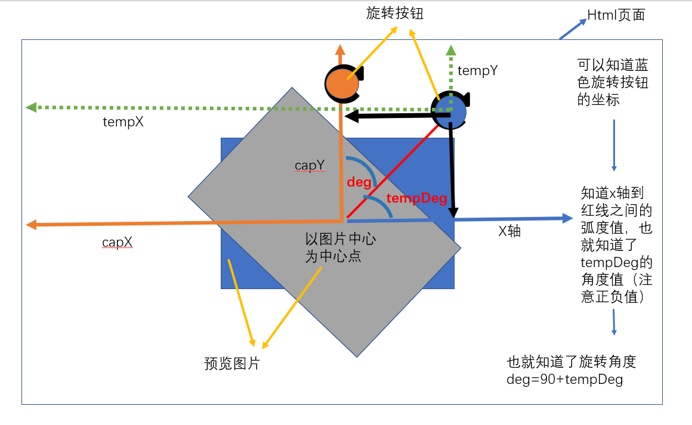

# 圣诞节！头像大作战！

今天我们来手把手教你实现一个超简版圣诞帽头像生成器。

## 实现功能思路：

1. 叠加帽子和头像：通过选择图片，展示头像预览。通过绝对定位，将预览图片、帽子叠加在一起。
2. 实现帽子功能：拖拽、旋转、缩放。
3. 生成头像图片：用一个 Javascript 库（html2canvas.js）将 avatar 整个截下来成一个 `canvas`，将截下来的 `canvas` 的图片数据赋给 `img` 标签，展示出来。
4. 完成基本功能后，完善其他小功能，如：切换帽子

## 1. 叠加帽子和头像

通过 `input:file` 标签选择文件
```html
<input type="file" name="" id="upload" accept="image/*" 
onchange="loadImage()">
```
```javascript
function loadImage() {
    /*创建文件读取对象*/
    let file = new FileReader();
    /*读取文件*/
    file.readAsDataURL(document.getElementById('upload').files[0]);
    /*读取完后，对象本身的result属性就是最后的链接*/
    file.onload = function (params) {
        document.getElementById('avatar_img').src = file.result;
    }
}
```
通过绝对定位叠加帽子和头像：
```html
<style>
#avatar {
    width: 300px;
    height: 300px;
    position: relative;
    margin: auto;
    overflow: hidden;
}

#avatar #avatar_img {
    width: 300px;
}

#avatar #avatar_template {
    width: 100%;
    height: 100%;
}

#hatBox {
    width: 100px;
    position: absolute;
}
</style>
<div id="avatar">
    <div id="hatBox">
        
        <!-- 旋转缩放控制点 -->
        <span id="rotateImg"></span>
        <span id="spreadImg"></span>
    </div>
    
</div>
```
## 2. 实现帽子功能
### 2.1 拖拽帽子
要实现拖拽帽子，需要给帽子父级`hatBox`绑定鼠标按下事件，实现思路：
1. 已知鼠标第一次点的时候的坐标(originX, originY)，
2. 已知每次帽子距离左上角距离预览图片左上角的距离(inX, inY)，
3. 已知预览图片左上角在html页面距左上(imgX, imgY)（假设以预览图片左上角为中心）。
4. 可以算出刚开始鼠标点击时，鼠标距离帽子左上角(disX, disY)，然后假设每次移动鼠标的坐标(nowX, nowY)
可以计算出以预览图片左上角为中心，帽子的(left, top)值:
```javascript
disX = originX - imgX - inX
disY = originY - imgY - inY
left = (nowX - disX) - imgX
top = (nowY - disY) - imgY
```


```javascript
let hatBox = document.getElementById('hatBox');
hatBox.onmousedown = dragHatStart;
hatBox.ontouchstart = dragHatStart;

function dragHatStart(e) {
    //显示帽子白色边框
    hatBox.style.border = '1px dotted #eef';
    //展示旋转图标
    rotateImg.classList.add('active');
    //展示缩放图标
    spreadImg.classList.add('active');

    /* 兼容pc端和移动端的点击坐标 */
    let clientObj = {};
    if (e.targetTouches) {
        clientObj.clientX = e.targetTouches[0].pageX;
        clientObj.clientY = e.targetTouches[0].pageY;
    } else {
        clientObj.clientX = e.clientX;
        clientObj.clientY = e.clientY;
    }

    /* disX：点击帽子时，点击坐标距离帽子图标最左端的距离
     * disY：点击帽子时，点击坐标距离帽子图标最上边的距离
     */
    let disX = clientObj.clientX - avatarLefthatBox.offsetLeft;
    let disY = clientObj.clientY - avatarTophatBox.offsetTo
    
    /* 兼容pc端 */
    document.onmousemove = dragHatMove; // 实现拖拽
    document.onmouseup = dragHatEnd; // 不拖拽时要处理的程序

    /* 兼容移动端 */
    document.ontouchmove = dragHatMove;
    document.ontouchend = dragHatEnd;


    /* 给document绑定的mousemove事件处理程序 */
    function dragHatMove(e) {
        /* 兼容移动端和pc端的点击的坐标点 */
        let clientObj = {};
        if (e.targetTouches) {
            clientObj.clientX = e.targetTouches.pageX;
            clientObj.clientY = e.targetTouches.pageY;
        } else {
            clientObj.clientX = e.clientX;
            clientObj.clientY = e.clientY;
        }
        /*newLeft: 帽子距离预览图片最左端的距离
        * newTop: 帽子距离预览图片最上边的距离
        */
        let newLeft = clientObj.clientX - avatarLe- disX;
        let newTop = clientObj.clientY - avatarTopdisY;

        /*maxLeft: 最大能移动帽子的left值
        *....
        */
        let maxLeft = avatar.offsetWidthhatBox.offsetWidth / 2;
        let minLeft = -hatBox.offsetWidth / 2;
        let maxTop = avatar.offsetHeighthatBox.offsetHeight / 2;
        let minTop = -hatBox.offsetHeight / 2;

        /*对移动过程中每次的left和top值和最大最小值进行比较*/
        if (newLeft >= maxLeft) {
            newLeft = maxLeft;
        }
        if (newLeft <= minLeft) {
            newLeft = minLeft;
        }
        if (newTop >= maxTop) {
            newTop = maxTop;
        }
        if (newTop <= minTop) {
            newTop = minTop;
        }
        
        /*将计算好的newLeft、newTop赋予hatBox，实现拖拽功能*/
        hatBox.style.left = newLeft + 'px';
        hatBox.style.top = newTop + 'px';
    }

    /*给document绑定的mouseup事件处理程序*/
    function dragHatEnd(e) {
        document.onmousemove = null;//取消move事件，不然还会跟着鼠标走
        document.ontouchend = null;//兼容移动端
    }
    
};
```

### 2.2 旋转帽子
要实现旋转帽子，我们通过加入可以旋转控制点，给他绑定鼠标按下的事件来实现，思路：
1. 可以计算出当前帽子最中心的点在 HTML 页面里的坐标(capX, capY)；
2. 假设每次鼠标在 HTML 页面坐标是(tempX, tempY)，就可以求出旋转的角度 deg
```javascript
Math.atan2(y,x)可以得到坐标系中(0,0)到(y,x)这条线和x轴之间的弧度
deg = Math.atan2(tempY - capY,tempX - capX) / Math.PI * 180 + 90
```
  
具体代码：
```javascript
rotateImg.onmousedown = rotateStart;
rotateImg.ontouchstart = rotateStart;
function rotateStart(e) {
    /*curOffsetX：帽子中心在html页面里的x坐标
    *curOffsetY：帽子中心在html页面里的y坐标
    */
    let curOffsetX = avatarLeft + hatBox.offsetLeft + tempImg.offsetWidth / 2;
    let curOffsetY = avatarTop + hatBox.offsetTop + tempImg.offsetHeight / 2;
    document.onmousemove = roteteMove;
    document.onmouseup = rotateEnd;
    document.ontouchmove = roteteMove;
    document.ontouchend = rotateEnd;

    e.stopPropagation();//防止冒泡

    function rotateEnd(e) {
        document.onmousemove = null;
        document.ontouchmove = null;
    }
    function roteteMove(e) {
        let clientObj = {};
        if (e.targetTouches) {
            clientObj.clientX = e.targetTouches[0].pageX;
            clientObj.clientY = e.targetTouches[0].pageY;
        } else {
            clientObj.clientX = e.clientX;
            clientObj.clientY = e.clientY;
        }
        //result：计算图片旋转的角度
        let result = Math.atan2(clientObj.clientY - curOffsetY, clientObj.clientX - curOffsetX) / Math.PI * 180 + 90;
       
        //通过修改css属性transform:rotate来改变帽子的旋转角度
        hatBox.style.transform = 'rotate(' + result + 'deg)';
    }

}
```
### 2.3 缩放帽子
要实现缩放帽子，我们通过加入可以缩放控制点，给他绑定鼠标按下的事件来实现，思路：
1. 已知当前帽子的宽度，长度，和帽子的比例；
2. 计算出帽子右下角在 HTML 页面的坐标；
3. 加上当前鼠标的坐标，可以求出帽子增大了多少宽度，而高度就按比例换算即可；

```javascript
//全局下保存原来帽子的尺寸
let originHatSize = { w: hatBox.offsetWidth, h: hatBox.offsetHeight };
//全局下保存原来帽子的比例，防止缩放时图片变形
let hatSizeRate = originHatSize.w / originHatSize.h;//拉伸帽子时，先记下比例，防止帽子变形

spreadImg.onmousedown = spreadStart;
spreadImg.ontouchstart = spreadStart;
    
function spreadStart(e) {
    /*保存最初点击时的坐标点*/
    let originDot = {};
    if (e.targetTouches) {
        originDot.clientX = e.targetTouches[0].pageX;
        originDot.clientY = e.targetTouches[0].pageY;
    } else {
        originDot.clientX = e.clientX;
        originDot.clientY = e.clientY;
    }
    document.onmousemove = spreadMove;
    document.ontouchmove = spreadMove;
    document.onmouseup = function (e) {
        /*当松开鼠标时要同步修改全局里保存的帽子尺寸*/
        originHatSize.w = hatBox.offsetWidth;
        originHatSize.h = hatBox.offsetHeight;
        document.onmousemove = null;
    }
    document.ontouchend = function (e) {
        originHatSize.w = hatBox.offsetWidth;
        originHatSize.h = hatBox.offsetHeight;
        document.onmousemove = null;
    }

    e.stopPropagation();//取消冒泡，防止drag事件的影响

    function spreadMove(e) {
        let curDot = {};
        if (e.targetTouches) {
            curDot.clientX = e.targetTouches[0].pageX;
            curDot.clientY = e.targetTouches[0].pageY;
        } else {
            curDot.clientX = e.clientX;
            curDot.clientY = e.clientY;
        }
        //spreadWidth：计算出横向上放大的距离
        let spreadWidth = curDot.clientX - originDot.clientX;
        //将spreadWidth加上全局保存的原来的帽子的宽度，得出最新的帽子的宽度
        hatBox.style.width = originHatSize.w + spreadWidth + 'px';
        //知道图片比例和图片宽度，可以算出图片高度
        hatBox.style.height = (hatBox.offsetWidth) / hatSizeRate + 'px';
    }
}
```

## 3. 生成头像图片

### 3.1 引入 html2canvas.js
因为要 canvas 不能直接做图片的旋转贴图，所以我们用一种偷懒的方式来做，通过 html2canvas 库来实现。他可以把 HTML + CSS 渲染的内容直接导出成为 canvas。
首先，在 HTML 中引入 `html2canvas.js`。
```html
<script src="./html2canvas.js"></script>
```
### 3.2 给下载的按钮绑定点击事件
```html
<button id="download" onclick="downloadImage()">下载</button>
```
```javascript
function downloadImage() {
    hatBox.style.border = 'none';// 去除hatBox的白色边框
    rotateImg.classList.remove('active');// 隐藏旋转图标
    spreadImg.classList.remove('active');// 隐藏缩放图标
    
    /* 使用 html2canvas.js 里的方法，语法：
    * html2canvas(element).then(function(canvas){
    *    console.log(canvas);
    *    //这里的canvas就是截图成功后返回的canvas
    * })
    */
    html2canvas(document.getElementById('avatar')).then(function (canvas) {
        //获取canvas的链接
        resultImageUrl = canvas.toDataURL("image/png");
        //将该链接赋值给展示结果里的img元素
        let resultImg = document.getElementById('result-img');
        resultImg.src = resultImageUrl;
        resultImg.onload = function () {
            //这里判断 top 值只是让每次下载完后，帽子都回去一个正常的top值，可有可无
            if (hatBox.offsetTop < 0) {
                hatBox.style.top = 0;
            }
            // 创建一个 a 标签，设置 download 属性，点击时下载文件
            var save_link = document.createElement('a');
            // 设置下载的链接
            save_link.href = resultImageUrl;
            // 设置下载的图片名称
            save_link.download = 'avatar.png';
            // 通过方法手动触发点击
            save_link.click();
            // 切换是否完成图片下载，该函数在下边
            showResult(true);
        }
    });
}
```
由于微信浏览器不能做到下载，所以我们在生成好 canvas 之后，就切换图片修改区 modify-area 和图片完成区 result-area。这样用户就可以长按 canvas 保存头像了。
我们通过在全局下定义一个 `showResult` 函数，来完成切换功能。
```javascript
function showResult(status) {
    if (status) {
        // 展示图片完成区，隐藏修改区
        document.getElementById('modify-area').classList.add('hide');
        document.getElementById('result-area').classList.add('active');
    } else {
        //隐藏图片完成区，展示修改区
        document.getElementById('modify-area').classList.remove('hide');
        document.getElementById('result-area').classList.remove('active');
    }
}
```
## 4. 切换不同帽子
### 4.1 给上一页，下一页按钮绑定事件

```html
<button id="prev" onclick="prevTemplate()">上一个</button>
<button id="next" onclick="nextTemplate()">下一个</button>
```
```javascript
function prevTemplate() {
    var current = parseInt(document.getElementById('avatar_template').alt);
    // img文件夹里是01.png - 40.png
    // current：通过这一次的帽子img元素里的alt值计算出前一个帽子的索引
    current = (current - 1 + 40) % 41;
    if (current === 0) {
        current = 1;
    }
    //将前一个帽子的作为新的帽子
    document.getElementById('avatar_template').src = './cap/' + (current < 10 ? '0' + current : current) + '.png';
    //同步修改alt值，因为current是通过alt值来定位的
    document.getElementById('avatar_template').alt = current;
}

/* 解释同理上边 */
function nextTemplate() {
    var current = parseInt(document.getElementById('avatar_template').alt);
    current = (current + 1) % 41;
    if (current === 0) {
        current = 1;
    }
    document.getElementById('avatar_template').src = './cap/' + (current < 10 ? ('0' + current) : current) + '.png';
    document.getElementById('avatar_template').alt = current;
}
```

如此，一个简版圣诞头像生成器就完成拉！完整代码见 GitHub：https://github.com/szisa/christmas
